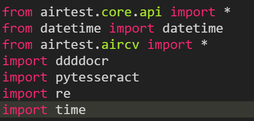

# X9TBot
一个基于 Airtest 实现的抖音小游戏自动化脚本，支持自动登录、自动打怪、自动领奖等功能，解放双手、轻松挂机！
抖音小游戏--《逍遥九重天》

## ✨ 功能特色
- 自动识别并点击游戏内按钮。
  应对游戏内不同场景，例如：玩家战力排行榜挑战（仙武台），截图识别用户当前战力选择最优对手，获取最大收益。                        
- 真机USB连接模拟
- 自动识别奖励领取界面并完成领奖
- 兼容多种分辨率和界面提示

## 🛠 技术栈
- [Airtest](https://airtest.netease.com/) - 用于 UI 自动化
- ADB - 使用 adb 工具连接，并可在不同分辨率下适配运行
- Python 3.x
  
  相关库:
  
  
  
- 图像识别+脚本操作
